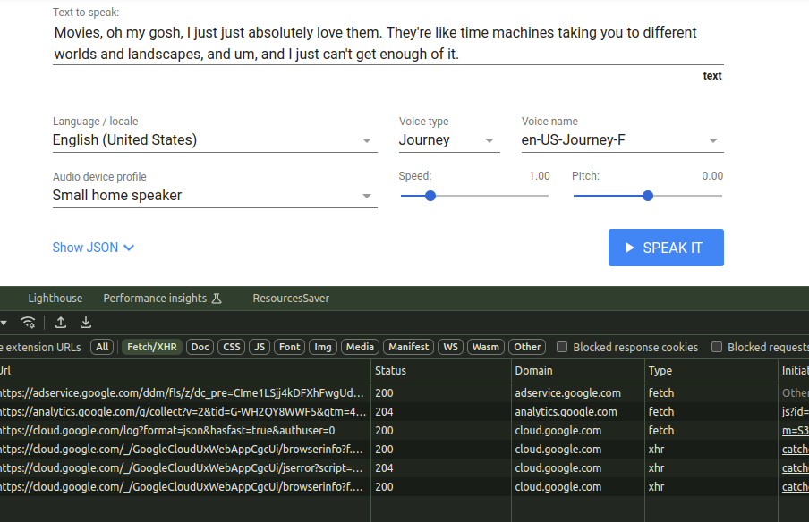
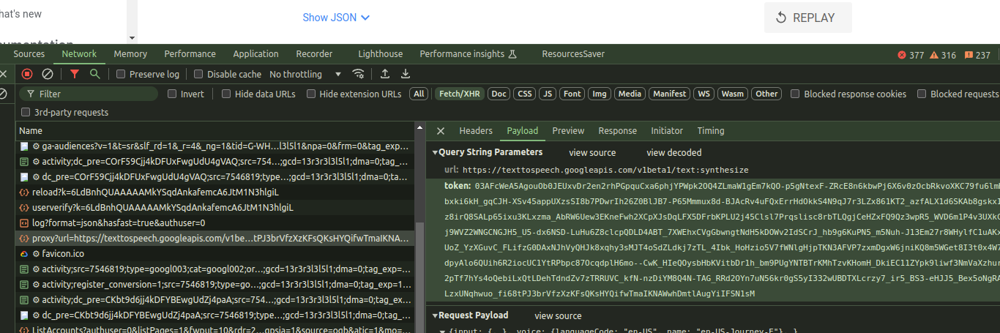

# text-to-speech-crawl

## How to Work

### 1. Crawl Content from Google Cloud Text-to-Speech API

This project allows you to convert text into speech by sending requests to the [Google Cloud Text-to-Speech API](https://cloud.google.com/text-to-speech).

\*Note :

- If you encounter a "bad request" or authentication error, you should create and obtain a token from Google Cloud Text-to-Speech (Detaisl at below).

### 2. Convert Content to MP3

The returned audio content is in base64 format, which is then converted and saved as an MP3 file.

## Example Usage

```typescript
import path from "path";
import textToSpeech from "text-to-speech-crawl";
import { DeviceClass } from "text-to-speech-crawl/type/type";

export const exampleTextToSpeech = async () => {
  try {
    console.log("----------Start convert to mp3");
    const token =
      "03AFcWeA4gbhj2FDM8trHBZ72as-co49vscXq9RVFHxkRYnVv2khU4QngLUZz5VQJy7TV5ZSr862a2I7uciZERG5m0EjSTGBOPh7upvWh3pveKkF6xjfWsFsvh_uzWJ-bJl818mxm9dhS4a4V28lGipoTKcddHznKQjDViIhrczKULA9m2wJ0nThZ9gaKX6X52oCiw4z_zMaNVFQBraN6EDpduMdQ3XIDBSx6LeP_jf7Ehe5xLWCeHoFfrHsLCWAz4DyT_5ptYcX3NU6RsSgRPbJuyio9R7BwhHCIVgvgDzMWcvwbXdMNnC3uXhiGgzbK6iBTrt-bm9sNgIRbVMjYAumPu9a28G8gEOPeLXjcTqA3X3PdgVW1xNxPp2mOI2cMoB8DfklXrcWtURRDhf-GmYs6G74byl7Lspf3pbw_43iGUHVuOIdtO7oYWLQ7RlAn2zPAfU6W2Y_2YONAK7aRoWaSN31bp53HyuhTLbVO5VSRUzWC6QHSSxaRCYaulmd3V56O0GiJ79eImUcTeP6I2xPdAiQfFoBWCq09Lbl0Wj60-regijkoOfZ9azohdNi0hkereqTHJ5gzE5HQoJMZHyI_UMoqnZiKoRUrhlmPri8cX0-mtHszVu2U4BZ5u_sBAG41T2uBLCVGda6cl_Xg-vdbiGOtXhOyQ6C0gdhXSVBVgxwS2LfwUsjmPCGKWHwl4n3PesJbYGzikYrz-DTf8T1tWJAMHVWAlak-jV2_UheYKu3EVSiUezCgjnlyc1coiRg02JoIj9yVZKyi_AWKgWvlXcPSrgBxiJbhpbWw-6DfRsg_-l7uQoGiCQdb2LZRxBkd1reL3h3wG1poYyS76v0IQDj9TjPlJEuzU8_wbqnLjNDxtrdSJpS0PEE7RNQoG6mJsQHGUf7awf852R1VeFaWMNj7Fj5R-hNKc4QhZHH5yX0PiOL2Fa_o";
    const response = await textToSpeech(
      {
        input: {
          text: "Movies, oh my gosh, I just just absolutely love them. They're like time machines taking you to different worlds and landscapes, and um, and I just can't get enough of it.",
        },
        voice: {
          languageCode: "en-US",
          name: "en-US-Journey-F",
        },
        audioConfig: {
          audioEncoding: "LINEAR16",
          pitch: 0,
          speakingRate: 0,
          effectsProfileId: [DeviceClass.SMALL_BLUETOOTH_SPEAKER_CLASS_DEVICE],
        },
      },
      path.join(__dirname, `example${new Date().getTime()}.mp3`),
      token
    );
  } catch (error: any) {
    console.log(error?.message);
  }
};
```

## How to config : https://cloud.google.com/text-to-speech/docs/reference/rest/v1/text/synthesize

### 2. voice : https://cloud.google.com/text-to-speech/docs/reference/rest/Shared.Types/StreamingSynthesizeConfig#VoiceSelectionParams

1. Supported voices and languages https://cloud.google.com/text-to-speech/docs/voices
2. Enter void to voice.

### 3. audioConfig : https://cloud.google.com/text-to-speech/docs/reference/rest/v1/AudioConfig

1. pitch : from -20 to 20
2. speakingRate : from 0.25 to 4
3. effectsProfileId : https://cloud.google.com/text-to-speech/docs/audio-profiles

wearable-class-device Smart watches and other wearables, like Apple Watch, Wear OS watch
handset-class-device Smartphones, like Google Pixel, Samsung Galaxy, Apple iPhone
headphone-class-device Earbuds or headphones for audio playback, like Sennheiser headphones
small-bluetooth-speaker-class-device Small home speakers, like Google Home Mini
medium-bluetooth-speaker-class-device Smart home speakers, like Google Home
large-home-entertainment-class-device Home entertainment systems or smart TVs, like Google Home Max, LG TV
large-automotive-class-device Car speakers
telephony-class-application Interactive Voice Response (IVR) systems

## Test (create a file mp3 from text)

- npm run test

## How to get free token on [Cloud.google](https://cloud.google.com/text-to-speech)

** Please run Browser with Incognito 

1. Go to diablog at Put Text-to-Speech into action on https://cloud.google.com/text-to-speech on 

2. Take button F12 =>>>>>> go to Network on new bottom board =>>>>>> Click to "SPEAK IT"

3. Check request name "proxy?url ..............." and get token on "Request URL" .
4. put token to "textToSpeech" function .
